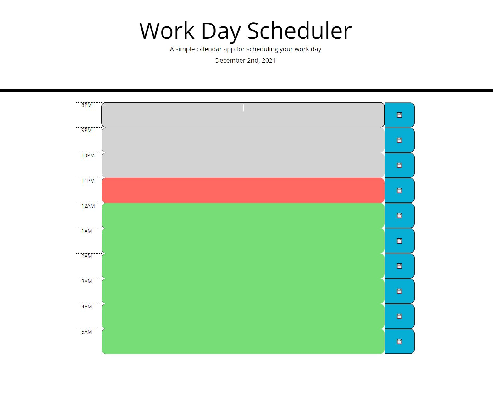

# Day Planner
Provided an original html code and style sheet, the goal was to create a daily planner that highlights current hour, showing past in grey, and future in green. Gives user a way to save their schedule in local storage for future usage.

## Day Planner 

[Check it out here!](https://mcstewart76.github.io/DayPlanner/)

>**Picture of the site**

